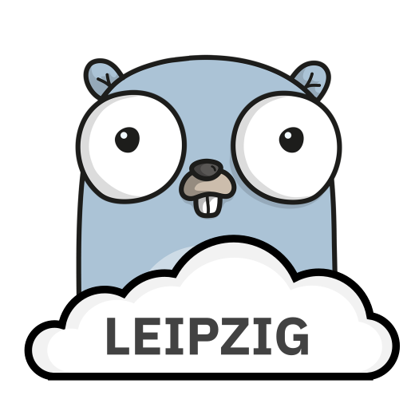

# Logo for the Cloud-Native and Golang Leipzig Meetup



<a rel="license" href="http://creativecommons.org/licenses/by/4.0/"></a><br />This work is licensed under a <a rel="license" href="http://creativecommons.org/licenses/by/4.0/">Creative Commons Attribution 4.0 International License</a>.

## Convert SVG to PNG

The following instructions assumes that [ImageMagick](https://www.imagemagick.org/) is available:

```bash
$ convert -background none cloud-native-and-golang-leipzig.{svg,png}
```
